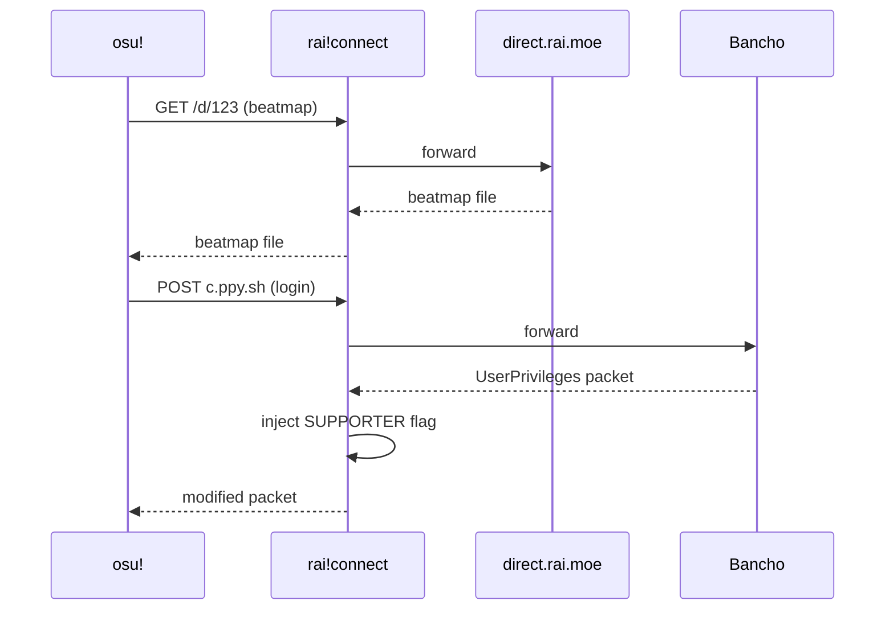

# rai!connect

Local HTTPS proxy enabling osu!direct through the [rai.moe](https://rai.moe) beatmap mirror.

## How It Works

When osu! launches with `-devserver localhost`, all `*.ppy.sh` domains resolve to `127.0.0.1`. The proxy intercepts requests and routes them:

| Request | Destination | Notes |
|---------|-------------|-------|
| `/d/`, `/thumb/`, `/preview/` | `direct.rai.moe` | Beatmap downloads |
| `c.ppy.sh` | Bancho | Login/chat, with supporter injection |
| Everything else | `*.ppy.sh` | Scores, multiplayer, etc. |

### Supporter Injection

The osu! client receives a `UserPrivileges` packet (ID 71) from Bancho on login. This packet contains a privilege bitmask. The proxy parses the binary packet and sets bit 2 (the `SUPPORTER` flag), making the client display osu!direct UI. Your actual Bancho privileges remain unchanged.

## Usage

**Option A: One-click launch**
1. Launch rai!connect (accept UAC prompt)
2. Click **Connect & Launch osu!**

**Option B: Manual launch**
1. Launch rai!connect and click **Start Proxy Only**
2. Create an osu! shortcut with target: `"C:\...\osu!.exe" -devserver localhost`
3. Launch osu! from the shortcut

## FAQ

### Is this safe?

Yes. The proxy only intercepts network traffic locally. No game files are modified. Your scores, multiplayer sessions, and account data flow through official servers. The only changes:

- Beatmap download URLs are rewritten to use the mirror
- The supporter bit is set in your local privilege packet (server-side privileges are unaffected)

### Will I get banned?

No. From Bancho's perspective, you're a normal client making normal requests. The `-devserver` flag is an official osu! feature for tournament and development servers. The supporter injection only affects your local client's UI state.

### Why does it need admin privileges?

Three reasons:

- **Port 443**: Binding to privileged ports requires elevation on Windows
- **Hosts file**: The proxy adds entries for `*.localhost` subdomains (Windows doesn't resolve them by default)
- **Certificate store**: Installing the self-signed TLS certificate requires admin

### Does this work with osu!lazer?

No. Lazer has native beatmap downloading and doesn't use the osu!direct system.

### What if I already have supporter?

Nothing changes. The injection performs a bitwise OR, so existing supporters keep all their privileges.

## License

MIT
