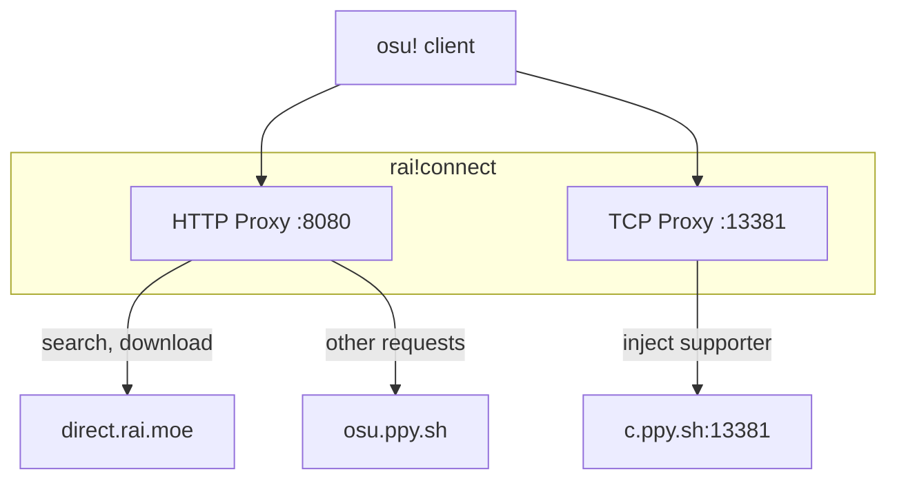

# rai!connect

Local proxy enabling osu!direct through the [rai.moe](https://rai.moe) beatmap mirror.

## How It Works



- **HTTP Proxy**: Routes osu!direct requests (search, download, thumbnails) to rai.moe
- **TCP Proxy**: Forwards Bancho traffic to official servers, injecting supporter privileges

## Installation

Download from [releases](https://github.com/rai-osu/connect/releases) or build from source:

```bash
pnpm install
pnpm tauri build
```

## Usage

1. Launch rai!connect
2. Click **Connect & Launch osu!**
3. osu!direct is now enabled

## FAQ

### Is this safe?

Yes. Only osu!direct requests are intercepted. All gameplay traffic (login, scores, multiplayer) passes through to official servers unchanged.

### Will I get banned?

No. This doesn't modify the game client. It's equivalent to using any beatmap mirror website.

### Does this work with osu!lazer?

No. osu!lazer has its own beatmap download system.

## License

MIT
