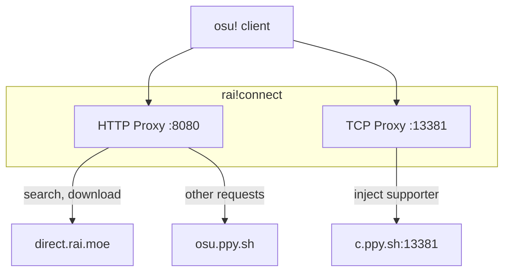

# rai!connect

Local proxy enabling osu!direct through the [rai.moe](https://rai.moe) beatmap mirror.

## How It Works



### HTTP Proxy

Routes osu!direct requests to rai.moe while forwarding everything else to official servers.

**Requests handled locally (via rai.moe):**
- `/web/osu-search.php` - Beatmap search
- `/web/osu-search-set.php` - Beatmap set search
- `/web/osu-getbeatmapinfo.php` - Beatmap info
- `/d/*` - Beatmap downloads
- `/thumb/*` and `/preview/*` (on `b.ppy.sh`) - Thumbnails and previews

**Requests forwarded to ppy.sh:**
- Login and authentication
- Score submission
- Multiplayer
- All other game functionality

### TCP Proxy

Forwards Bancho traffic (TCP port 13381) to official servers. When supporter injection is enabled, the proxy:

1. Buffers incoming server packets
2. Parses the Bancho protocol to identify `UserPrivileges` packets
3. Modifies the privilege flags to include supporter status
4. Forwards the modified packets to the client

This enables osu!direct in the client without requiring an actual supporter subscription.

## Installation

Download from [releases](https://github.com/rai-osu/connect/releases) or build from source:

```bash
pnpm install
pnpm tauri build
```

## Usage

1. Launch rai!connect
2. Click **Connect & Launch osu!**
3. osu!direct is now enabled

## FAQ

### Is this safe?

Yes. Only osu!direct requests are intercepted. All gameplay traffic (login, scores, multiplayer) passes through to official servers unchanged.

### Will I get banned?

No. This doesn't modify the game client. It's equivalent to using any beatmap mirror website.

### Does this work with osu!lazer?

No. osu!lazer has its own beatmap download system.

## License

MIT
