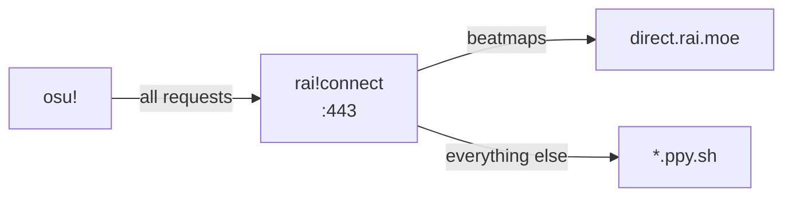

# rai!connect

Local HTTPS proxy enabling osu!direct through the [rai.moe](https://rai.moe) beatmap mirror.

## How It Works

Launch osu! with `-devserver localhost` and all traffic routes through the local proxy. Beatmap requests go to the mirror; login, scores, and multiplayer stay on official servers.

## Features

- HTTPS proxy with auto-generated TLS certificate
- Auto-setup (certificate + hosts file) on first run
- One-click launch button
- Supporter injection for osu!direct access

## Usage

1. Launch rai!connect (accept UAC prompt)
2. Click **Connect & Launch osu!**
3. Done

## FAQ

**Is this safe?** Yes. Only beatmap requests are redirected. Gameplay traffic is untouched.

**Will I get banned?** No. This doesn't modify the game client.

**Why admin privileges?** Port 443, hosts file, and certificate installation require elevation.

## License

MIT
