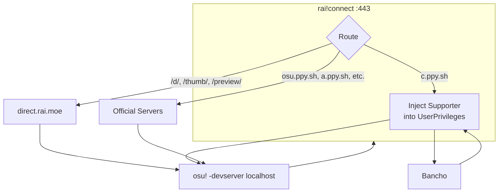

# rai!connect

Local HTTPS proxy enabling osu!direct through the [rai.moe](https://rai.moe) beatmap mirror.

## How It Works

When osu! launches with `-devserver localhost`, the client resolves all `*.ppy.sh` domains to `127.0.0.1`. The proxy intercepts these requests and:

1. **Beatmap requests** (`/d/`, `/thumb/`, `/preview/`) → Redirected to `direct.rai.moe`
2. **Bancho packets** (`c.ppy.sh`) → Forwarded to official servers, but the response is modified to inject supporter privileges
3. **Everything else** → Passed through to official servers unchanged

### Supporter Injection

The osu! client receives a `UserPrivileges` packet (ID 71) from Bancho on login containing a privilege bitmask. The proxy parses this binary packet and sets bit 2 (`SUPPORTER` flag), making the client display osu!direct UI without an active subscription. Your actual account privileges on Bancho remain unchanged.

## Usage

1. Launch rai!connect (accept UAC prompt)
2. Click **Connect & Launch osu!**

## FAQ

### Is this safe?

Yes. The proxy only intercepts network traffic locally—no game files are modified. Your scores, multiplayer sessions, and account data all flow through official servers. The only modifications are:
- Beatmap download URLs are rewritten to use the mirror
- The supporter bit is set in your local privilege packet (server-side privileges are unaffected)

### Will I get banned?

No. From Bancho's perspective, you're a normal client making normal requests. The `-devserver` flag is an official osu! feature intended for tournament/development servers. The supporter injection only affects your local client's UI state.

### Why does it need admin privileges?

Three reasons:
- **Port 443**: Binding to ports below 1024 requires elevation on Windows
- **Hosts file**: The proxy adds entries for `*.localhost` subdomains since Windows doesn't resolve them by default
- **Certificate store**: Installing the self-signed TLS certificate to the trusted root store requires admin

### Does this work with osu!lazer?

No. Lazer has native beatmap downloading and doesn't use the legacy osu!direct system.

### What happens to my supporter status if I already have it?

Nothing changes. The injection performs a bitwise OR, so existing supporters keep all their privileges.

## License

MIT
