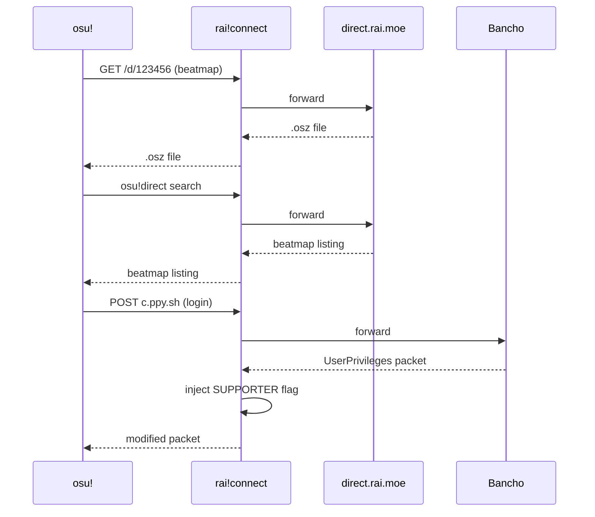

# rai!connect

[](https://github.com/rai-osu/connect/releases)
[](https://github.com/rai-osu/connect/releases)

[](LICENSE)
[](https://ko-fi.com/checksum)

Desktop client for [rai.moe](https://rai.moe) beatmap mirror. Download beatmaps in-game with osu!direct, no supporter tag required.

## Installation

| Platform | Download                              |
| -------- | ------------------------------------- |
| Windows  | `.msi` installer or `.exe` standalone |
| macOS    | `.dmg` (Intel and Apple Silicon)      |
| Linux    | `.AppImage`, `.deb`, or `.rpm`        |

Download from [GitHub Releases](https://github.com/rai-osu/connect/releases).

## Usage

1. Launch rai!connect
2. Complete the onboarding wizard
3. Create a desktop shortcut in Settings

After setup, double-click the shortcut to launch osu! with rai. No need to open the app manually.

Alternatively, open rai!connect and click **Connect & Launch osu!**, or click **Start Proxy Only** and launch osu! manually with `osu!.exe -devserver localhost`.

## How It Works


```mermaid
sequenceDiagram
    participant osu as osu!
    participant proxy as rai!connect
    participant mirror as direct.rai.moe
    participant bancho as Bancho

    osu->>proxy: GET /d/123456 (beatmap)
    proxy->>mirror: forward
    mirror-->>proxy: .osz file
    proxy-->>osu: .osz file

    osu->>proxy: osu!direct search
    proxy->>mirror: forward
    mirror-->>proxy: beatmap listing
    proxy-->>osu: beatmap listing

    osu->>proxy: POST c.ppy.sh (login)
    proxy->>bancho: forward
    bancho-->>proxy: UserPrivileges packet
    proxy->>proxy: inject SUPPORTER flag
    proxy-->>osu: modified packet
```

The `-devserver localhost` flag routes all `*.ppy.sh` traffic through the local proxy:

| Request                                 | Destination       |
| --------------------------------------- | ----------------- |
| Beatmap downloads, thumbnails, previews | direct.rai.moe    |
| osu!direct search                       | direct.rai.moe    |
| Login, chat, scores, multiplayer        | Bancho (official) |

### Supporter injection

The proxy optionally modifies the `UserPrivileges` packet (ID 71) from Bancho, setting bit 2 (SUPPORTER) in the privilege bitmask. This enables the osu!direct UI without affecting your actual account.

## FAQ

### Safety

**Is this safe?**

Yes. The proxy only intercepts traffic locally. No game files are modified, scores go to official servers, and supporter injection is purely cosmetic.

**Will I get banned?**

No. The `-devserver` flag is an official osu! feature for tournament and development servers. From Bancho's perspective, you're a normal client.

### Admin privileges

**Why does it need admin/root?**

- **Port 443** - HTTPS requires a privileged port
- **Hosts file** - Adds `*.localhost` entries (Windows doesn't resolve these by default)
- **Certificate store** - Installs a self-signed TLS certificate and stores its key in the system keychain to intercept HTTPS traffic.
- **Cleanup** - Removes hosts entries on disconnect

Hosts entries added:

```text
127.0.0.1 osu.localhost
127.0.0.1 c.localhost
127.0.0.1 a.localhost
127.0.0.1 b.localhost
127.0.0.1 i.localhost
```

### Credentials

**Why do I get logged out when switching between rai and normal osu!?**

The `-devserver` flag makes osu! think it's connecting to a different server. The client stores credentials per-server, so switching between `localhost` and normal osu! requires logging in again.

**What if I already have supporter?**

Nothing changes. The injection performs a bitwise OR, so existing privileges are preserved.

### Compatibility

**Does this work with osu!lazer?**

No. Lazer has native beatmap downloading.

**Can I use this with other private servers?**

Yes. Pass `--devserver <server>` when launching:

```bash
rai-connect.exe --launch-osu --devserver ripple.moe
```

Non-beatmap traffic forwards to the specified server instead of Bancho. Beatmap downloads still go through rai.moe.

## Development

Built with [Tauri 2](https://tauri.app), [SvelteKit](https://kit.svelte.dev), and Rust.

```bash
pnpm install
pnpm tauri dev
pnpm tauri build
```

## Star History

<a href="https://www.star-history.com/#rai-osu/connect&type=date&legend=bottom-right">
 <picture>
   <source media="(prefers-color-scheme: dark)" srcset="https://api.star-history.com/svg?repos=rai-osu/connect&type=date&theme=dark&legend=bottom-right" />
   <source media="(prefers-color-scheme: light)" srcset="https://api.star-history.com/svg?repos=rai-osu/connect&type=date&legend=bottom-right" />
   
 </picture>
</a>

## License

MIT
